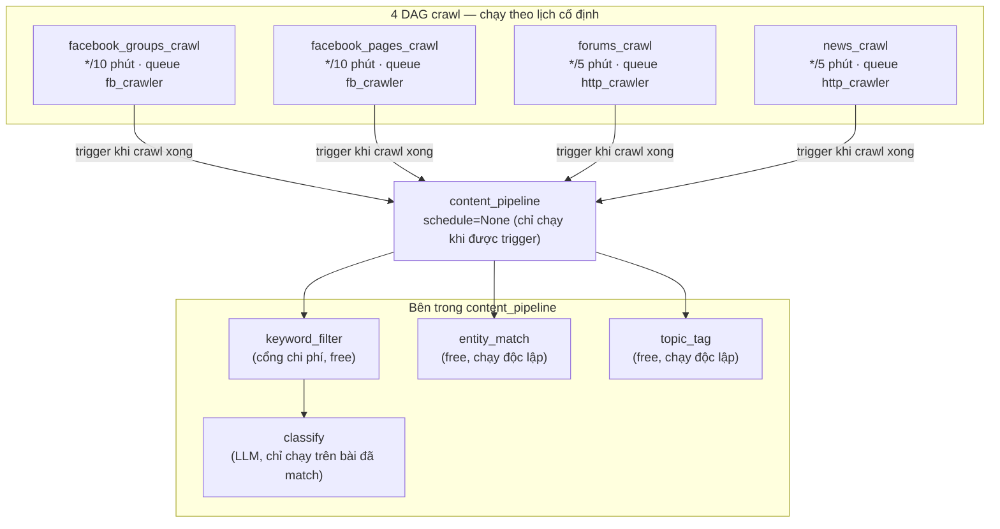
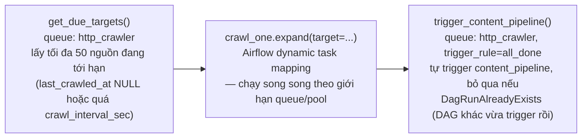
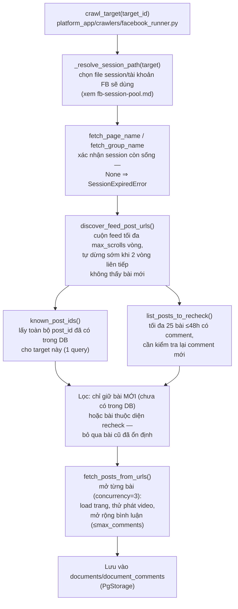

# Sơ đồ flow chạy DAG (Airflow)

## Tổng quan

## Chi tiết từng DAG crawl

Cả 4 DAG đều có cấu trúc 3 task giống nhau:

`get_due_targets` chỉ trả về **tối đa 50 nguồn/lần chạy** (`BATCH_CAP`) — nếu
backlog nhiều hơn (vd vừa import CSV hàng loạt), phải mất thêm vài chu kỳ mới
crawl hết.

## Queue & giới hạn song song

| Queue | Worker | Concurrency | Dùng cho |
|---|---|---|---|
| `fb_crawler` | `airflow-worker-fb` | 3 (`fb_playwright_pool`) | `crawl_one` của FB Group/Page — nặng, cần Playwright/Chromium thật |
| `http_crawler` | `airflow-worker-http` | 30 (`http_pool`) | `get_due_targets`, `trigger_content_pipeline`, toàn bộ `content_pipeline`, `crawl_one` của Forum/News — nhẹ, HTTP thuần |

`crawl_one` của FB Group/Page còn bị giới hạn thêm bởi **số tài khoản
Facebook** đang có trong pool session (xem
[`fb-session-pool.md`](fb-session-pool.md)) — Page tự động round-robin giữa
các tài khoản, Group phải gán thủ công 1 tài khoản cụ thể (do yêu cầu đã là
thành viên group).

## Bên trong `crawl_one` khi target là FB Group/Page

Trước đây bước **G** không tồn tại — mọi bài còn hiện trong feed đều bị fetch
lại toàn bộ (kể cả bài đã biết, đã ổn định), đây là phần tốn thời gian nhất
của cả DAG. Giờ chỉ fetch bài thật sự mới hoặc bài cần kiểm tra lại.

`discover_feed_post_urls`/`fetch_posts_from_urls` chạy trên 1 trình duyệt
Playwright có cấu hình chống bị nhận diện là bot: `user_agent` giống Chrome
desktop thật, `timezone_id: Asia/Ho_Chi_Minh` khớp `locale: vi-VN`, không
chặn tải font (trước đây có chặn).

## Vì sao `content_pipeline` không chạy theo lịch riêng

`content_pipeline` có `schedule=None` — **chỉ chạy khi được 1 trong 4 DAG
crawl trigger** ở cuối, thay vì tự poll theo lịch cố định (cách cũ, đã bỏ vì
lãng phí — DAG chạy dù không có gì mới để xử lý). Khi 2+ DAG crawl hoàn thành
gần như cùng lúc, `trigger_dag()` được gọi với `execution_date` chính xác tới
microsecond (`replace_microseconds=False`) để tránh đụng độ; nếu vẫn đụng
(cực hiếm), DAG gọi sau chỉ bắt `DagRunAlreadyExists` và bỏ qua — mục tiêu
(content_pipeline chạy) đã đạt được bởi DAG kia rồi.

## Bên trong `content_pipeline`

- `keyword_filter` → `classify`: **tuần tự** — `classify` (gọi LLM, tốn tiền)
  chỉ chạy trên document đã được `keyword_filter` đánh dấu `matched` (lọc
  theo `organization_keywords`/`keywords_catalog` của từng tổ chức).
- `entity_match`, `topic_tag`: **độc lập**, không phụ thuộc `keyword_filter`
  — chạy trên toàn bộ document mới, miễn phí (không gọi LLM).

Xem chi tiết đầy đủ 4 cơ chế này ở
[`classification-pipeline.md`](classification-pipeline.md).
