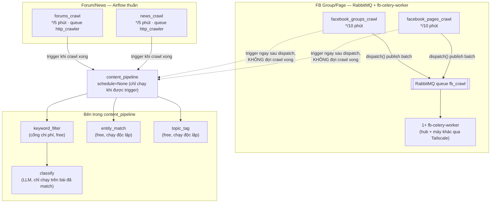
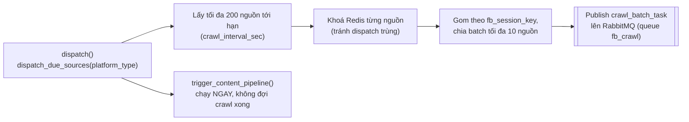
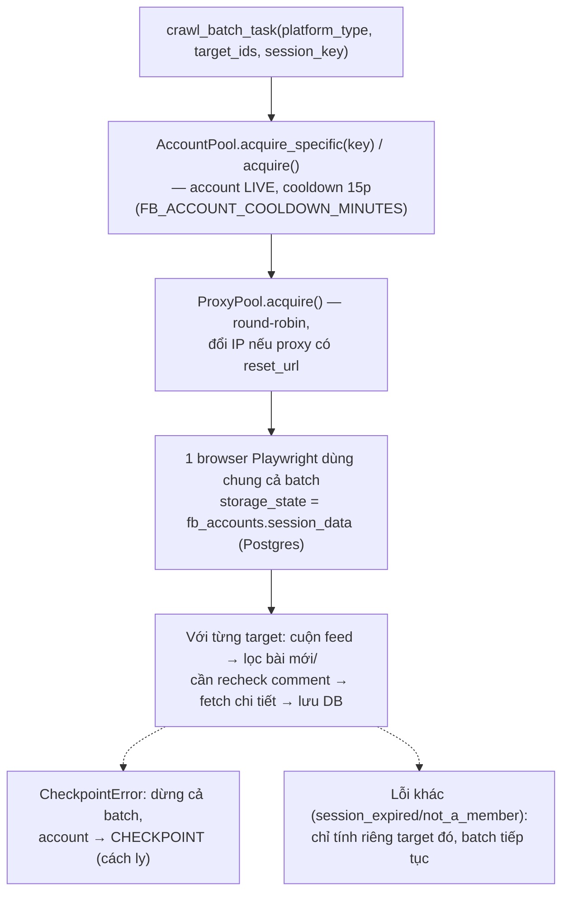
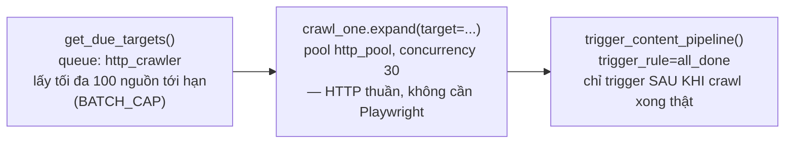

# Sơ đồ flow chạy DAG (Airflow) + crawl Facebook

FB Group/Page và Forum/News đi theo 2 luồng khác hẳn nhau kể từ khi FB
chuyển sang RabbitMQ + `fb-celery-worker` (Airflow không còn chạy Playwright
trực tiếp). Đọc đúng phần áp dụng cho loại nguồn bạn đang quan tâm.

## Tổng quan

## FB Group/Page

### 1. Dispatch (Airflow, queue `http_crawler` — nhẹ, không Playwright)

`platform_app/crawlers/dispatch_tasks.py` — `dispatch_due_sources()` chỉ
query Postgres và publish message, **không** import Playwright (queue
`http_crawler` không có Chromium). Việc crawl thật xảy ra bất đồng bộ ở
`fb-celery-worker`, ngoài tầm nhìn của Airflow — vì vậy
`trigger_content_pipeline()` bắn ngay sau dispatch, xử lý dữ liệu của batch
**trước đó** đã crawl xong, không phải batch vừa dispatch.

Gom nhóm theo `fb_session_key`: nguồn cùng key (kể cả `NULL` — chưa gán
cũng tính 1 nhóm) rơi vào chung batch. Group **cần được gán cụ thể** (do
phải là thành viên mới đọc được nội dung) — hiện tất cả FB Group đều đang
`fb_session_key = NULL`, bị crawl bằng account round-robin ngẫu nhiên như
Page, dễ gây lỗi/crawl rỗng nếu account đó chưa join group.

### 2. `fb-celery-worker` (1+ instance, có thể chạy trên nhiều máy)

`platform_app/crawlers/batch_tasks.py` (`crawl_batch_task`) +
`account_pool.py` + `proxy_pool.py`. Nhiều worker cùng consume 1 queue
`fb_crawl` (RabbitMQ tự chia — competing consumer, không cấu hình cứng
worker nào nhận batch nào) — an toàn khi chạy song song vì `AccountPool`
khoá theo dòng Postgres (`FOR UPDATE SKIP LOCKED`), không có 2 batch nào
tranh được cùng 1 account.

Chi tiết chạy 1 worker trên máy khác qua Tailscale:
[`fb-worker-remote.md`](fb-worker-remote.md). Chi tiết session/account pool:
[`fb-session-pool.md`](fb-session-pool.md).

### Giới hạn thông lượng thật sự

Bị chặn bởi **số account**, không phải số worker/concurrency: mỗi account
cooldown 15 phút giữa 2 lần dùng → tối đa `(số account) × 4` batch/giờ, mỗi
batch 10 nguồn. Ví dụ với 5 account: tối đa 20 batch/giờ = 200 nguồn/giờ —
dù có bao nhiêu worker/slot rảnh cũng không vượt được mốc này. Tăng
`FB_CELERY_CONCURRENCY` hay thêm worker chỉ có ích khi số account đủ để lấp
đầy các slot đó; nếu ít account mà tăng concurrency quá cao, các slot dư chỉ
nhận "không có account khả dụng" và bỏ qua, không tốn tài nguyên thật (chưa
mở browser) nhưng cũng không tăng tốc.

## Forum/News

Vẫn giữ nguyên cấu trúc cũ, chạy hoàn toàn trong Airflow — 3 task giống nhau
cho cả 2 DAG:

`get_due_targets` trả tối đa 100 nguồn/lần chạy (`BATCH_CAP` trong
`dag_forums.py`/`dag_news.py`) — nếu backlog nhiều hơn (vd vừa import CSV
hàng loạt), mất thêm vài chu kỳ mới crawl hết.

## Vì sao `content_pipeline` không chạy theo lịch riêng

`content_pipeline` có `schedule=None` — chỉ chạy khi 1 trong 4 DAG crawl
trigger nó ở cuối, thay vì tự poll theo lịch cố định (cách cũ, đã bỏ vì lãng
phí — DAG chạy dù không có gì mới để xử lý). Khi 2+ DAG trigger gần như cùng
lúc, `trigger_dag()` dùng `execution_date` chính xác tới microsecond
(`replace_microseconds=False`) để tránh đụng độ; nếu vẫn đụng (cực hiếm),
DAG gọi sau chỉ bắt `DagRunAlreadyExists` và bỏ qua — mục tiêu
(content_pipeline chạy) đã đạt được bởi DAG kia rồi.

**Lưu ý riêng cho FB** (khác Forum/News): trigger bắn ngay sau *dispatch*,
không đợi *crawl* xong thật (xem mục "FB Group/Page" ở trên) — vì crawl FB
giờ chạy bất đồng bộ ngoài Airflow.

## Bên trong `content_pipeline`

- `keyword_filter` → `classify`: **tuần tự** — `classify` (gọi LLM, tốn tiền)
  chỉ chạy trên document đã được `keyword_filter` đánh dấu `matched` (lọc
  theo `organization_keywords`/`keywords_catalog` của từng tổ chức).
- `entity_match`, `topic_tag`: **độc lập**, không phụ thuộc `keyword_filter`
  — chạy trên toàn bộ document mới, miễn phí (không gọi LLM).

Xem chi tiết đầy đủ 4 cơ chế này ở
[`classification-pipeline.md`](classification-pipeline.md).
